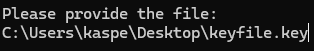

# PasswordPOC
 Proof of concept of zero knowlegde password manager

 ## how to use
 Follow the promts, the most important thing to remember is the keyfile generated is the same keyfile used to decrypt your passwords

 # disclaimer
 ## IT IS THE USERS RESPONSIBLILITY TO STORE THE KEY 
 Save the key file on a usb stick or another safe location.

### potential implemtations
* automatic key generation of usb stick to force users to use usb stick
* automatic key file search of all usb sticks attached to pc
* maui UI

# **Instructions to run the application**
   - Make sure you have dotnet sdk installed
   - Open a terminal
   - Navigate to the project folder
   - Then write " dotnet run --project PasswordPOC "

## *alternative run*
   - just open the solution file with visual studio and run

# *Screenshots of the product*
   - *single factor login*  

   - *automatic generation of keyfiles (which is currently placed at desktop)*  

   - *simple interface  

   - *console application reconices if you simply drag the file to the console*  

   - *password generation if wished for*  

   - *easy overview of passwords*  

# *Discussion about security of your product*

## *What do you protect against (who are the threat actors)*
   - Unauthorized Access
   - Data Breaches
   - Man-in-the-Middle Attacks

## *What is your security model (encryption, key handling etc.)*
   - Objective: to create a local password manager based on zero knowlegde and encryption
   - Encryption: Derived passwords are encrypted using AES.
   - Local storage: Encrypted passwords are stored in a local file, accessed by SQLite.
   - Password creation: Passwords will be generated based on the desired size between 8-15 characters in length.
   - Master Key Generation: The master key file is 256 bytes long and filled with random values generated by a cryptographically secure algorithm.

## *Any pitfalls or limitations in your solution.*
   - User Responsibility: the security of the program is completly dependend on the users ability to safely store the key, and making sure there are no physical access by others at the same time
   - Password lenght: when using the provided password generator to make passwords there is stil a responsibility for the user to generate a long password for those services with which they have chosen to use the passwords with to fend off brute force attacks

### made by Kasper Rasmussen
